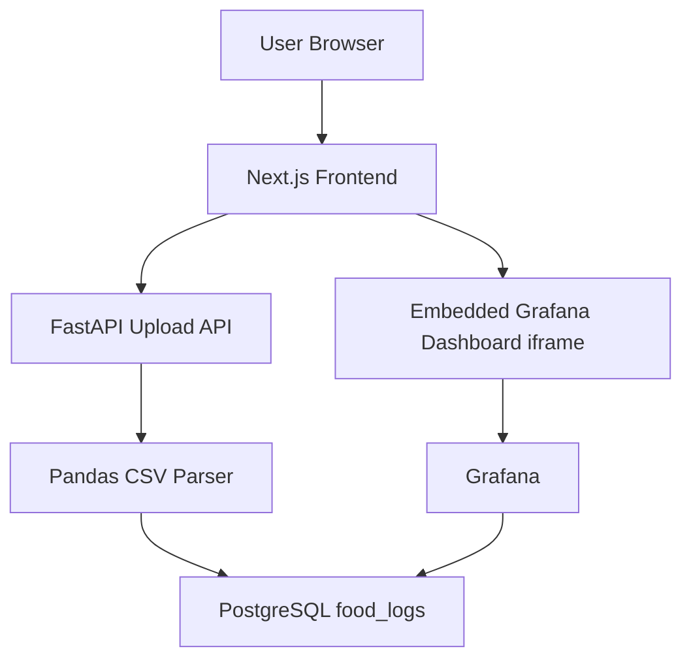

# MyFitnessPal CSV Data Exploration Pipeline with Grafana

This project is focused on one workflow: upload a MyFitnessPal CSV file, preprocess and store the data in PostgreSQL, and explore the data in Grafana dashboards.

## Project Overview

The repository contains:

- A Next.js frontend for CSV upload and Grafana embedding.
- A FastAPI backend for CSV ingestion and preprocessing.
- A PostgreSQL database for storing normalized food logs.
- A provisioned Grafana instance connected to PostgreSQL.
- Docker Compose setup for local Linux-compatible execution.

## Architecture



## Core User Flow

1. Open the app.
2. Go to upload page and select a MyFitnessPal CSV export.
3. Frontend sends file to `POST /upload`.
4. Backend preprocesses and inserts rows into `food_logs`.
5. Open dashboard page to explore panels backed by PostgreSQL.

## Screenshots

### Upload Page


### Dashboard Page


## Backend API

- `GET /health`
- `POST /upload` (multipart form-data with `file`)

### CSV Preprocessing

- Normalize column names to snake_case.
- Validate required columns.
- Convert date and numeric fields.
- Remove empty rows.
- Fill missing values where needed.
- Remove duplicates.

Required columns:

- `date`
- `meal`
- `food`
- `calories`
- `carbs`
- `protein`
- `fat`

## Data Model

Table: `food_logs`

- `id` integer primary key
- `date` date
- `meal` text
- `food` text
- `calories` float
- `carbs` float
- `protein` float
- `fat` float

## Grafana Setup in This Repo

Provisioned files:

- `grafana/datasource.yaml` (PostgreSQL datasource)
- `grafana/dashboard-provider.yaml` (dashboard provider)
- `grafana/dashboard.json` (version-controlled dashboard)
- `grafana/grafana.ini` (iframe embedding enabled)

Included panels:

- Calories per day
- Macronutrient distribution
- Meal distribution
- Weekly calorie trend

## Local Run with Docker

1. Ensure `.env` exists at repository root.
2. Start services:

```bash
docker compose up --build
```

3. Open:

- Frontend: `http://localhost:3001`
- Backend docs: `http://localhost:8000/docs`
- Grafana: `http://localhost:3000`

## Environment Variables

Required for current auth-free flow:

- `NEXT_PUBLIC_API_BASE_URL`
- `NEXT_PUBLIC_GRAFANA_URL`
- `NEXT_PUBLIC_GRAFANA_DASHBOARD_URL`
- `DATABASE_URL`
- `FRONTEND_ORIGINS`
- `POSTGRES_DB`
- `POSTGRES_USER`
- `POSTGRES_PASSWORD`
- `GRAFANA_ADMIN_USER`
- `GRAFANA_ADMIN_PASSWORD`

## Example CSV

See `examples/myfitnesspal-sample.csv`.

## Next Steps to Build Better Grafana Dashboards

1. Add variables (templating) in Grafana for meal and date range filters.
2. Add derived metrics in SQL:
   - daily calorie average (7-day rolling)
   - macro ratio percentages (`protein/(protein+carbs+fat)` etc.)
   - meal-level trend by week
3. Add alert rules in Grafana for threshold conditions (example: calories > target).
4. Add annotations for user events (diet changes, workout blocks) by storing marker rows in a dedicated table.
5. Create a second dashboard focused on weekly and monthly comparisons.

## Hosting Guide

### Option A: Fastest (All-in-one Docker VM)

Host full stack on one Linux VM (DigitalOcean, AWS EC2, Azure VM):

1. Install Docker + Docker Compose.
2. Clone repo and set `.env`.
3. Run `docker compose up -d --build`.
4. Put Nginx/Caddy in front with HTTPS and domain names.

Use this if you want simple control and lowest setup complexity.

### Option B: Managed Split Deployment (Recommended)

- Frontend: Vercel or Netlify
- Backend: Render or Railway
- PostgreSQL: Neon or Supabase
- Grafana: Grafana Cloud

Deployment sequence:

1. Deploy PostgreSQL and get connection string.
2. Deploy backend with `DATABASE_URL` and `FRONTEND_ORIGINS`.
3. In Grafana Cloud, add PostgreSQL datasource and import `grafana/dashboard.json`.
4. Enable embedding in Grafana and create a shared/dashboard URL.
5. Deploy frontend and set:
   - `NEXT_PUBLIC_API_BASE_URL`
   - `NEXT_PUBLIC_GRAFANA_URL`
   - `NEXT_PUBLIC_GRAFANA_DASHBOARD_URL`

### Option C: Hybrid

- Host frontend/backend on one platform (Render/Railway)
- Use managed PostgreSQL + Grafana Cloud

This keeps app deployment simple while avoiding database/observability maintenance.

## Production Hardening Checklist

1. Add backend rate limiting on upload endpoint.
2. Add upload size limits and stricter CSV validation.
3. Move secrets to platform secret manager.
4. Restrict Grafana iframe embedding to your frontend domain.
5. Add database backups and retention policy.
6. Add structured logs and request tracing.

## Expected Output

A working pipeline where users can upload MyFitnessPal CSV exports, data is cleaned and stored in PostgreSQL, and Grafana dashboards are used for exploration and analysis.
