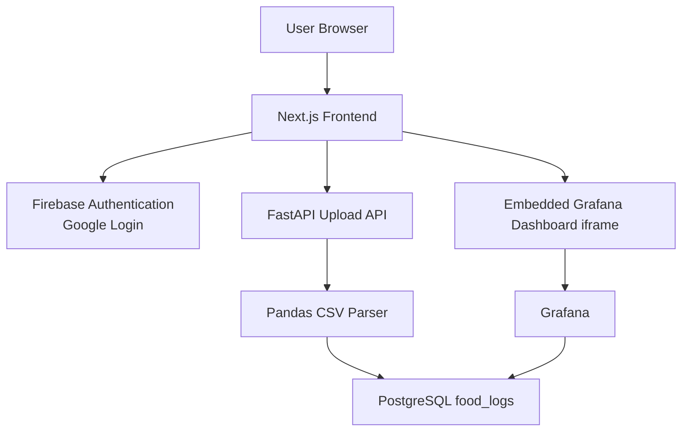
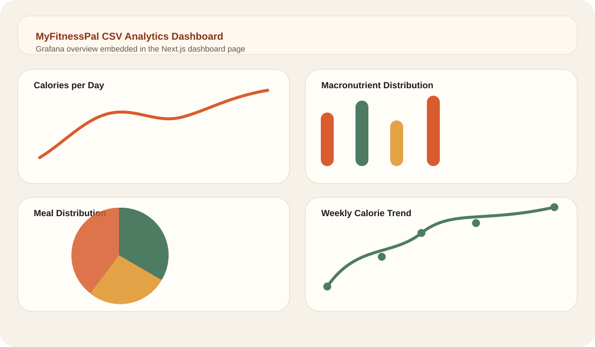
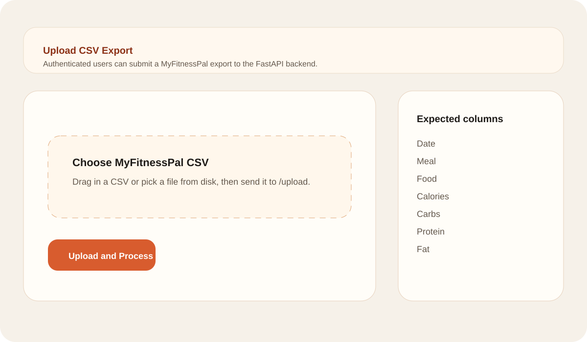

# MyFitnessPal CSV Analytics Dashboard with Grafana

A full-stack analytics application for uploading MyFitnessPal CSV exports, cleaning and storing the data in PostgreSQL, and visualizing nutrition trends through embedded Grafana dashboards.

## Project Overview

The repository contains:

- A Next.js frontend with Firebase Authentication for Google login.
- A FastAPI backend for CSV ingestion and preprocessing.
- A PostgreSQL database for nutrition records.
- A provisioned Grafana instance connected directly to PostgreSQL.
- Docker and Docker Compose setup for local Linux-friendly deployment.

## Architecture Diagram



## Repository Structure

```text
.
├── backend/
│   ├── csv_parser.py
│   ├── database.py
│   ├── Dockerfile
│   ├── main.py
│   ├── models.py
│   └── routers/
├── docs/
├── examples/
├── frontend/
│   ├── components/
│   ├── lib/
│   ├── pages/
│   ├── styles/
│   ├── Dockerfile
│   └── package.json
├── grafana/
│   ├── dashboard-provider.yaml
│   ├── dashboard.json
│   ├── datasource.yaml
│   └── grafana.ini
├── docker-compose.yml
├── requirements.txt
└── README.md
```

## Core User Flow

1. The user signs in on the login page with Google through Firebase Authentication.
2. The authenticated user lands on the upload page.
3. The frontend submits a MyFitnessPal CSV file to `POST /upload`.
4. The backend validates and normalizes the file with pandas.
5. Cleaned rows are inserted into PostgreSQL table `food_logs`.
6. Grafana reads the same table and updates the dashboard panels.
7. The dashboard page embeds the provisioned Grafana board in an iframe.

## Backend Details

### API Endpoints

- `GET /health`: health check for the FastAPI service.
- `POST /upload`: accepts `multipart/form-data` with `file=<csv>`.

### CSV Preprocessing

The parser performs the following steps:

- Normalizes column names to snake_case and applies common aliases.
- Validates required columns: `date`, `meal`, `food`, `calories`, `carbs`, `protein`, `fat`.
- Converts the `date` column to real dates.
- Converts macro and calorie columns to numeric values.
- Removes empty rows and duplicate entries.
- Drops rows with invalid dates or missing food names.
- Fills empty meal names with `Unspecified`.

### Database Schema

The FastAPI app creates the `food_logs` table automatically on startup.

| Column | Type |
| --- | --- |
| id | Integer |
| date | Date |
| meal | String |
| food | String |
| calories | Float |
| carbs | Float |
| protein | Float |
| fat | Float |

## Grafana Dashboards

The provisioned dashboard includes these panels:

- Calories per day
- Macronutrient distribution
- Meal distribution
- Weekly calorie trend

Grafana is configured to:

- Connect directly to PostgreSQL using the provisioned datasource.
- Load `grafana/dashboard.json` automatically at container start.
- Allow iframe embedding for the frontend dashboard page.
- Enable anonymous viewer access for local development.

## Frontend Pages

- `/login`: Google login screen using Firebase Authentication.
- `/upload`: authenticated CSV upload form with loading state.
- `/dashboard`: authenticated page embedding the Grafana dashboard.

## Setup Instructions

### Prerequisites

- Docker and Docker Compose
- A Firebase project configured for Google sign-in
- Optional: Node.js 20+ and Python 3.12+ if you want to run services outside Docker

### Environment Variables

Copy `.env.example` to `.env` and fill in your Firebase values.

Important variables:

- `NEXT_PUBLIC_FIREBASE_API_KEY`
- `NEXT_PUBLIC_FIREBASE_AUTH_DOMAIN`
- `NEXT_PUBLIC_FIREBASE_PROJECT_ID`
- `NEXT_PUBLIC_FIREBASE_APP_ID`
- `NEXT_PUBLIC_FIREBASE_MESSAGING_SENDER_ID`
- `NEXT_PUBLIC_FIREBASE_STORAGE_BUCKET`
- `NEXT_PUBLIC_API_BASE_URL`
- `NEXT_PUBLIC_GRAFANA_URL`
- `NEXT_PUBLIC_GRAFANA_DASHBOARD_URL`

### Run Locally with Docker

```bash
docker compose up --build
```

After startup:

- Frontend: http://localhost:3001
- FastAPI: http://localhost:8000
- Grafana: http://localhost:3000
- PostgreSQL: localhost:5432

### Local Development Without Docker

#### Frontend

```bash
cd frontend
npm install
npm run dev
```

#### Backend

```bash
python -m venv .venv
. .venv/bin/activate
pip install -r requirements.txt
uvicorn backend.main:app --reload --host 0.0.0.0 --port 8000
```

For local non-Docker backend execution, set `DATABASE_URL` to a reachable PostgreSQL instance and run from the repository root.

## Example CSV Format

See [examples/myfitnesspal-sample.csv](examples/myfitnesspal-sample.csv).

```csv
Date,Meal,Food,Calories,Carbs,Protein,Fat
2026-03-01,Breakfast,Greek Yogurt,130,9,16,4
2026-03-01,Lunch,Chicken Rice Bowl,540,52,38,14
```

## Screenshots

Dashboard preview:



Upload page preview:



## Deployment Guidance

### Frontend

Deploy `frontend/` to Vercel or Netlify.

Configure these environment variables in the frontend host:

- Firebase public keys
- `NEXT_PUBLIC_API_BASE_URL`
- `NEXT_PUBLIC_GRAFANA_URL`
- `NEXT_PUBLIC_GRAFANA_DASHBOARD_URL`

### Backend

Deploy the FastAPI service to Render or Railway.

Recommended production steps:

- Use a managed PostgreSQL database such as Supabase or Neon.
- Set `DATABASE_URL` to the managed instance.
- Lock down CORS with your production frontend origin.
- Add Firebase ID token verification server-side before exposing uploads publicly.

### Grafana

Use either:

- Grafana Cloud with the dashboard JSON imported and PostgreSQL connected.
- A Docker-hosted Grafana instance using the files in `grafana/`.

## Production Notes

- Firebase authentication is implemented on the frontend. The backend currently accepts uploads without verifying Firebase tokens, which keeps the local setup simple. For production, add token verification in FastAPI.
- Grafana anonymous access is enabled for local iframe embedding. Tighten this in production and use a secure sharing strategy.
- The frontend is styled with custom CSS to keep dependencies light and Docker builds predictable.

## Expected Output

With the required environment variables configured, the application provides:

- Google-authenticated access to the upload and dashboard pages.
- CSV ingestion and preprocessing through FastAPI.
- Nutrition records persisted in PostgreSQL.
- Embedded Grafana dashboards backed by live PostgreSQL queries.
